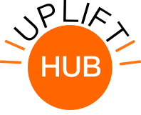

Welcome to the UPLIFT Biomedical Data Science Education Hub Portal!

Check out our [Community](community.html#working-groups), [Curriculum](curriculum.html#course-material), and [Collaborations](collaboration.html#student-research) to learn more!

🚧 This is very much under construction but stay tuned! 🚧

 
 

## About UPLIFT

The main goals of the UPLIFT Hub are to support activities to increase awareness of computational genomics and data science (CGDS) and cloud computing concepts, and address barriers to effective CGDS education. 

We coordinate with NIH cloud computing platforms to organize workshops, collect stakeholder input, disseminate materials, evaluate educational opportunities, and provide logistical support.
